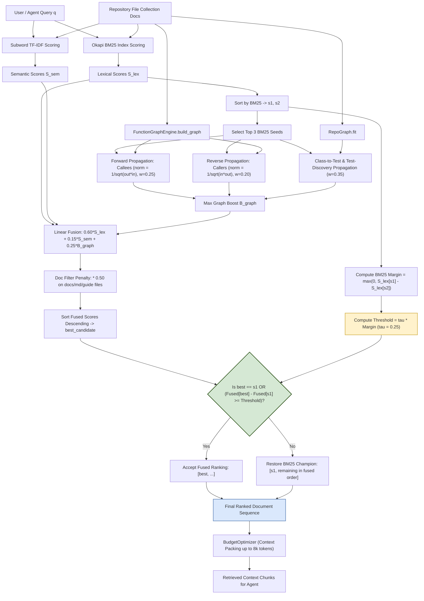

# RepoNeedle Stage 3.20 — ARM-101 End-to-End Dataflow Diagram

```mermaid
flowchart TD
    Q[User / Agent Query q] --> Lex[Okapi BM25 Index Scoring]
    Q --> Sem[Subword TF-IDF Scoring]
    
    Repo[Repository File Collection Docs] --> Lex
    Repo --> Sem
    Repo --> FG[FunctionGraphEngine.build_graph]
    Repo --> RG[RepoGraph.fit]

    Lex --> S_lex["Lexical Scores S_lex"]
    Sem --> S_sem["Semantic Scores S_sem"]
    
    S_lex --> S1S2["Sort by BM25 -> s1, s2"]
    S1S2 --> Margin["Compute BM25 Margin = max(0, S_lex[s1] - S_lex[s2])"]
    Margin --> Thresh["Compute Threshold = tau * Margin (tau = 0.25)"]

    S1S2 --> Seeds["Select Top 3 BM25 Seeds"]
    
    Seeds & FG --> Fwd["Forward Propagation: Callees (norm = 1/sqrt(out*in), w=0.25)"]
    Seeds & FG --> Rev["Reverse Propagation: Callers (norm = 1/sqrt(in*out), w=0.20)"]
    Seeds & RG --> C2T["Class-to-Test & Test-Discovery Propagation (w=0.35)"]
    
    Fwd & Rev & C2T --> G_boost["Max Graph Boost B_graph"]

    S_lex & S_sem & G_boost --> Fused["Linear Fusion: 0.60*S_lex + 0.15*S_sem + 0.25*B_graph"]
    Fused --> DocFilter["Doc Filter Penalty: * 0.50 on docs/md/guide files"]
    DocFilter --> FusedSort["Sort Fused Scores Descending -> best_candidate"]

    FusedSort & Thresh --> DamperCheck{"Is best == s1 OR (Fused[best] - Fused[s1] >= Threshold)?"}
    
    DamperCheck -- Yes --> KeepFused["Accept Fused Ranking: [best, ...]"]
    DamperCheck -- No --> RestoreBM25["Restore BM25 Champion: [s1, remaining in fused order]"]

    KeepFused --> RankedList["Final Ranked Document Sequence"]
    RestoreBM25 --> RankedList

    RankedList --> BudgetOpt["BudgetOptimizer (Context Packing up to 8k tokens)"]
    BudgetOpt --> Context["Retrieved Context Chunks for Agent"]

    style Thresh fill:#fff2cc,stroke:#d6b656,stroke-width:2px
    style DamperCheck fill:#d5e8d4,stroke:#274e13,stroke-width:2px
    style RankedList fill:#dae8fc,stroke:#6c8ebf,stroke-width:2px
```
